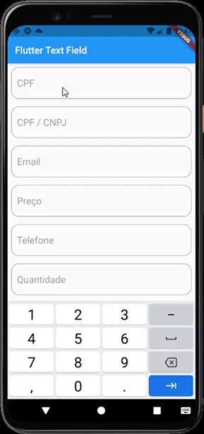

# flutter_text_field

Um pacote de campos textos personalizados, capazes de receber entradas no formato de CPF, CNPJ, email, Senha, Telefone, R$ e Números inteiros.

## Status

🚧 Em Construção 🚧

## Demonstração

 

## Uso 
Adicione as seguintes linhas no seu pubspec.yaml e faça um pub get.
```yaml
  flutter_text_field:
    git: 
      url: https://github.com/LeonardoJRibeiro/flutter_text_field
```

## Principais recursos

 - [X] Campo de CPF ou CNPJ com validação aritmética e máscara.
 - [X] Campo de telefone com máscara e validação por quantidade de dígitos.
 - [X] Campo de moeda com formatação brasileira por meio da biblioteca [intl](https://pub.dev/packages/intl).
 - [X] Campo de senha com possibilidade de visualização.
 - [X] Campo de email com validação por meio da biblioteca [email_validator](https://pub.dev/packages/email_validator).
 - [X] Campo numérico com validação de mínimo e máximo inteiro.
 - [ ] Campo numérico com ponto flutuante

 ## Exemplo
```dart

class Exemplo extends StatelessWidget {
  final controllerCpfCnpj = FutterTextEditingController();
  final controllerCpf = FutterTextEditingController();
  final controllerMoeda = FutterTextEditingController();
  final controllerTelefone = FutterTextEditingController();

  @override
  Widget build(BuildContext context) {
    return Scaffold(
      appBar: AppBar(
        title: Text('Flutter Text Field'),
      ),
      body: SingleChildScrollView(
        child: Form(
          child: Column(
            children: [
              FutterTextField.cpfCnpj(
                autovalidateMode: AutovalidateMode.onUserInteraction,
                labelText: 'CPF',
                hintText: 'Digite seu CPF',
                controller: controllerCpf,
                onlyCpf: true,
              ),
              FutterTextField.cpfCnpj(
                autovalidateMode: AutovalidateMode.onUserInteraction,
                labelText: 'CPF / CNPJ',
                hintText: 'Digite seu CPF ou CNPJ',
                controller: controllerCpfCnpj,
              ),
              FutterTextField.email(
                autovalidateMode: AutovalidateMode.onUserInteraction,
                labelText: 'Email',
                hintText: 'Digite seu email',
              ),
              FutterTextField.moeda(
                autovalidateMode: AutovalidateMode.onUserInteraction,
                labelText: 'Preço',
                hintText: 'Digite o preço',
                controller: controllerMoeda,
              ),
              FutterTextField.telefone(
                autovalidateMode: AutovalidateMode.onUserInteraction,
                labelText: 'Telefone',
                hintText: 'Digite seu telefone',
                controller: controllerTelefone,
              ),
              FutterTextField.numero(
                autovalidateMode: AutovalidateMode.onUserInteraction,
                labelText: 'Quantidade',
                hintText: 'Digite a quantidade',
                min: 5,
                max: 50,
              ),
              FutterTextField.senha(
                autovalidateMode: AutovalidateMode.onUserInteraction,
                labelText: 'Senha',
                hintText: 'Digite sua senha',
              ),
            ],
          ),
        ),
      ),
    );
  }
}
```


